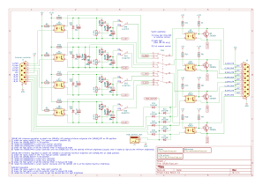
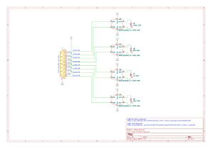

# GRUB

```
                          G-R-U-B
                          | | | |
                          | | | +----> <B>lue  (440nm) - Royal blue
                          | | +------> <U>V    (425nm) - Near Violet
                          | +--------> <R>ed   (660nm) - Deep red
                          +----------> <G>reen (525nm)
```

**GRUB** is a LEDs control board for an enlarger variable contrast & color head




